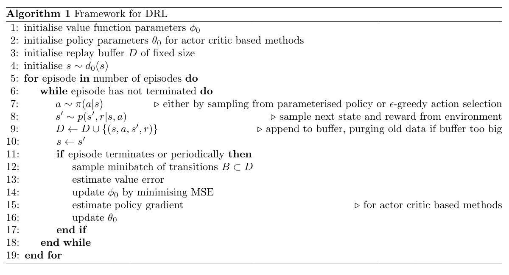

# Framework for DRL algorithms

| Algorithm | Action space | Buffer size | Sampling steps | Minibatch size |  Value target | Policy gradient | Action selection | Additions |
| --- | --- | --- | --- | --- | --- | --- | --- | --- |
| Actor critic | Discrete | 1 | 1 | 1 | $\delta=r+\gamma\ V(s^\prime)$ | $A(s,a) \nabla\ log(\pi)$ where $A(s,a) \approx \delta$ | Policy net softmax | - |
| PPO | Discrete | $\approx 32$ | $\approx 32$ | $\approx 32$ ordered sample | reward-go-to $R$ (cumulative sum of discounted rewards) | $A(s,a) \frac{\pi}{\pi_{t-1}}$ where $A(s,a) \approx$ cumulative sum of TD error  | Policy net softmax | Policy ratio is clipped |  
| DQN | Discrete | $\approx 10000$ | 1 | $\approx 32$ | $r+\gamma\ max_a(Q(s^\prime,A))$ | - | $\epsilon$-greedy | Target Q-net (hard updates) |
| DDPG | Continuous | $\approx 10000$ | 1 | $\approx 32$ | $r+\gamma\ Q(s^\prime,\mu(s^\prime))$ | $Q(s,\mu(s))$ | $\mu(s) + Noise$ | Target Q-net and policy net (soft updates) |
| TD3 | Continuous | $\approx 10000$ | 1 | $\approx 32$ | minimum $r+\gamma\ Q(s^\prime,\mu(s^\prime)+Noise)$ from 2 nets | $Q(s,\mu(s))$ | $\mu(s) + Noise$ | Target Q-net and policy net (soft updates, policy update is delayed) |
| SAC | Continuous | $\approx 10000$ | 1 | $\approx 32$ | $r+\gamma\ (min \ Q(s^\prime,\tilde{a^\prime})-\alpha log \pi_\theta(\tilde{a^\prime}|s^\prime)) \ \tilde{a^\prime} \sim \pi_\theta(\centerdot|s^\prime) $  | $min \ Q(s,\tilde{a_\theta}(s))-\alpha log \pi_\theta(\tilde{a_\theta}(s)|s)) $ | Target Q-net (soft updates), reparameterisation trick used for action selection |
